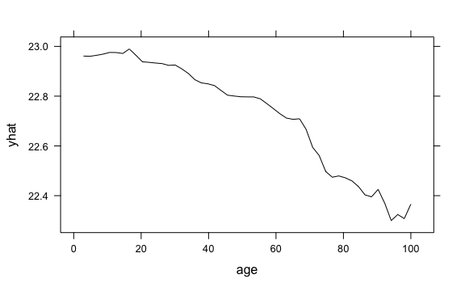

<!-- README.md is generated from README.Rmd. Please edit that file -->

# rstratx

<!-- badges: start -->

<!-- badges: end -->

The **rstratx** provides an interface to
[stratx](https://github.com/parrt/stratx), a Python library for A
Stratification Approach to Partial Dependence for Codependent Variables.
Currently, only the StratPD algorithm is supported (which only applies
to numeric features).

**WARNING:** This package is under heavy development. The underlying
Python code needs cleaned up, and imports aren’t really handled that
gracefully on the R side. Use at your own risk.

## Installation

``` r
# You can install the development version from GitHub:
if (!("remotes" %in% installed.packages()[, "Package"])) {
  install.packages("remotes")
}
remotes::install_github("bgreenwell/rstratx")
```

## Example

Here’s a basic example using the well-known Boston housing data set:

``` r
# Load required packages
library(pdp)      # for ordinary partial dependence
library(ranger)   # for random forest algorithm
#> Warning: package 'ranger' was built under R version 3.5.2
library(rstratx)  # for stratified partial dependence

# Load the Boston housing data
data(boston, package = "pdp")

# Fit a (default) random forest model
set.seed(1818)  # for reproducibility
rfo <- ranger(cmedv ~ ., data = boston)

# Compute stratified partial dependence for age
spd <- stratpd(
  X = subset(boston, select = -cmedv), 
  y = boston[, "cmedv", drop = FALSE],  # needs a one-column data frame (for now)
  feature_name = "age"
)

# Compare results
par(mfrow = c(1, 2), mar = c(4, 4, 1, 1) + 0.1)
plot(partial(rfo, pred.var = "age"), type = "l", las = 1)
plot(spd, type = "l", lwd = 2, las = 1, ylim = c(-10, 10))
```


